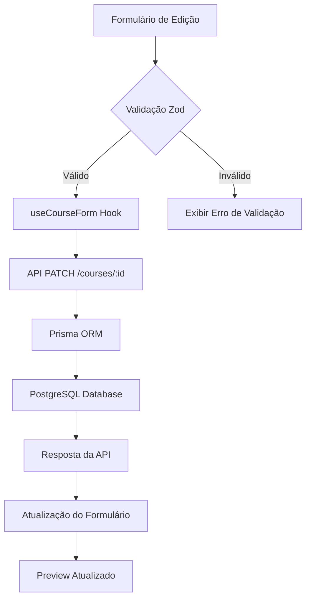

# Adicionar Campo de Duração na Página de Edição de Curso

## Visão Geral

Este documento especifica a implementação do campo de duração na página de edição de curso (`app/admin/courses/[id]/page.tsx`), garantindo consistência com o schema do banco de dados Prisma e proporcionando uma experiência de usuário intuitiva.

## Contexto do Problema

Atualmente, a página de edição de curso não possui o campo de duração, embora:
- O schema Prisma já define `duration: Int?` (em minutos) para a entidade Course
- O formulário de criação de lições já implementa campos de duração
- O campo é essencial para informações completas do curso

## Análise da Arquitetura Atual

### Estrutura do Banco de Dados
```prisma
model Course {
  duration    Int? // em minutos
  // outros campos...
}

model Lesson {
  duration    Int? // em segundos  
  // outros campos...
}
```

### Formulário Atual
A página de edição (`app/admin/courses/[id]/page.tsx`) possui:
- Título do curso
- Descrição
- Preço e Nível (grid 2 colunas)
- Categoria
- Thumbnail

## Especificação da Solução

### Alterações na Interface

#### 1. Posicionamento do Campo
- **Localização**: Adicionado ao grid de 2 colunas existente (preço/nível)
- **Layout**: Expandir o grid para 3 campos na mesma linha:
  - Preço (R$)
  - Nível  
  - Duração (minutos)

#### 2. Componente de Interface
```typescript
<div>
  <label className="flex items-center gap-2 text-sm font-medium text-gray-700 mb-2">
    <Clock className="w-4 h-4" />
    Duração (minutos)
  </label>
  <input
    type="number"
    {...form.register('duration', { valueAsNumber: true })}
    className="w-full px-3 py-2 border border-gray-300 rounded-lg focus:ring-2 focus:ring-blue-500 focus:border-blue-500"
    min="0"
    max="10080"
    placeholder="Ex: 120"
  />
</div>
```

### Alterações no Schema de Validação

#### 1. Hook useCourseForm.ts
```typescript
export const courseFormSchema = z.object({
  // campos existentes...
  duration: z.number()
    .min(0, 'Duração deve ser positiva')
    .max(10080, 'Duração máxima é 1 semana (10.080 minutos)')
    .optional()
    .or(z.literal(0)),
  // outros campos...
});
```

#### 2. Atualização dos Tipos
```typescript
export type CourseFormData = z.infer<typeof courseFormSchema>;
```

### Atualização do Preview do Curso

#### 1. Exibição na Prévia
Adicionar informação de duração no card de prévia:
```typescript
<div className="flex items-center justify-between text-sm text-gray-600 mb-2">
  <span className="flex items-center gap-1">
    <Award className="w-3 h-3" />
    {watch('level')?.charAt(0).toUpperCase() + watch('level')?.slice(1)}
  </span>
  <span className="flex items-center gap-1">
    <Clock className="w-3 h-3" />
    {formatDuration(watch('duration') || 0)}
  </span>
  <span className="flex items-center gap-1">
    <BookOpen className="w-3 h-3" />
    {watch('modules')?.length || 0} módulos
  </span>
</div>
```

#### 2. Função de Formatação
```typescript
const formatDuration = (minutes: number): string => {
  if (!minutes || minutes === 0) return '0 min';
  const hours = Math.floor(minutes / 60);
  const mins = minutes % 60;
  
  if (hours === 0) return `${mins} min`;
  if (mins === 0) return `${hours}h`;
  return `${hours}h ${mins}min`;
};
```

### Integração com Backend

#### 1. Mapeamento no useCourseForm
```typescript
// No loadCourse:
const formData = {
  // campos existentes...
  duration: course.duration || 0,
  // outros campos...
};

// No saveCourse:
const payload = {
  // campos existentes...
  duration: data.duration || null,
  // outros campos...
};
```

## Validação e Regras de Negócio

### Regras de Validação
- **Tipo**: Número inteiro
- **Valor mínimo**: 0 (opcional)
- **Valor máximo**: 10.080 minutos (1 semana)
- **Formato**: Somente números inteiros
- **Comportamento**: Campo opcional com valor padrão 0

### Casos de Uso
1. **Curso sem duração definida**: Campo vazio ou 0
2. **Curso com duração**: Valor em minutos (ex: 120 para 2 horas)
3. **Validação**: Prevenir valores negativos ou excessivamente altos

## Fluxo de Dados



## Considerações de UX

### Posicionamento Visual
- **Grid Layout**: Manter consistência visual com campos preço/nível
- **Ícone**: Usar `Clock` do lucide-react para representar duração
- **Placeholder**: "Ex: 120" para orientar o usuário

### Feedback Visual
- **Formatação**: Preview mostra duração formatada (ex: "2h 30min")
- **Validação**: Mensagens de erro claras para valores inválidos
- **Estados**: Campo opcional não exige preenchimento obrigatório

## Testes e Validação

### Cenários de Teste
1. **Campo vazio**: Deve salvar como null/0
2. **Valores válidos**: 30, 120, 480 minutos
3. **Valores inválidos**: -10, 20000 minutos
4. **Formatação**: Preview deve exibir corretamente
5. **Persistência**: Valor deve ser mantido após salvar/recarregar

### Integração
- **Compatibilidade**: Verificar se não quebra funcionalidades existentes
- **Performance**: Campo adicional não deve impactar carregamento
- **Responsividade**: Layout deve funcionar em dispositivos móveis

## Impacto no Sistema

### Alterações Necessárias
1. **Frontend**: Adicionar campo no formulário de edição
2. **Validação**: Estender schema Zod
3. **Tipos**: Atualizar interfaces TypeScript
4. **Preview**: Adicionar formatação de duração

### Compatibilidade
- **Schema DB**: Já existe, nenhuma migração necessária
- **API**: Endpoint já suporta o campo duration
- **Formulários**: Não afeta outros formulários existentes