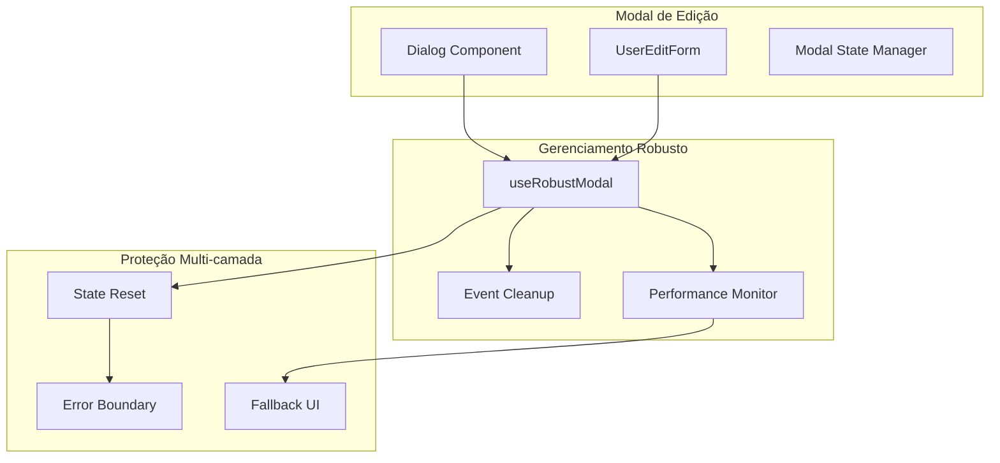

# Design Document: Correção de Congelamento do Modal de Edição de Contato

## Visão Geral

Este documento apresenta a solução para o problema de congelamento da interface quando o modal de edição de contato é fechado ou salvo na plataforma de cursos. O problema ocorre quando o modal desaparece visualmente, mas a página permanece congelada como se ainda estivesse aberto.

## Análise do Problema

### Problema Atual
- Modal de edição de contato desaparece visualmente após fechamento/salvamento
- Interface permanece congelada e não responsiva
- Usuário não consegue interagir com elementos da página
- Necessidade de recarregar a página para restaurar funcionalidade

### Causa Raiz Identificada
Com base na análise dos padrões do projeto e problemas similares já resolvidos, as causas prováveis são:

1. **Gerenciamento inadequado do estado do modal**: O estado `open` do Radix UI Dialog não está sendo sincronizado corretamente com o callback `onOpenChange`
2. **Event listeners não removidos**: Listeners de teclado e foco podem permanecer ativos após o fechamento
3. **Estados de loading não resetados**: Estados assíncronos podem não estar sendo limpos adequadamente
4. **Conflitos de toast**: Múltiplos sistemas de notificação podem causar travamentos

## Arquitetura da Solução

### Componentes Envolvidos


### Estratégia de Implementação

#### 1. Hook Personalizado `useRobustModal`
```typescript
interface RobustModalConfig {
  onOpen?: () => void;
  onClose?: () => void;
  onError?: (error: Error) => void;
  debugMode?: boolean;
}

interface RobustModalReturn {
  isOpen: boolean;
  openModal: () => void;
  closeModal: () => void;
  forceClose: () => void;
  isClosing: boolean;
}
```

**Funcionalidades:**
- Gerenciamento seguro de estado de abertura/fechamento
- Cleanup automático de event listeners
- Detecção e recuperação de estados inconsistentes
- Sistema de fallback para fechamento forçado
- Logging detalhado para debug

#### 2. Sistema de Cleanup Automático
- **Event Listeners**: Remoção de listeners de teclado, foco e clique
- **Timers**: Limpeza de setTimeout/setInterval pendentes
- **Observers**: Desconexão de MutationObserver e ResizeObserver
- **Estados Assíncronos**: Reset de estados de loading e submitting

#### 3. Monitoramento de Performance
- **Memory Leak Detection**: Monitoramento de vazamentos de memória
- **Request Monitoring**: Rastreamento de requisições pendentes
- **Render Performance**: Detecção de loops de renderização
- **Operação Silenciosa**: Sem logs ou toasts desnecessários

## Implementação Técnica

### 1. Hook `useRobustModal`

```typescript
// hooks/useRobustModal.ts
const useRobustModal = (config: RobustModalConfig = {}): RobustModalReturn => {
  const [isOpen, setIsOpen] = useState(false);
  const [isClosing, setIsClosing] = useState(false);
  const timeoutRef = useRef<NodeJS.Timeout>();
  const listenersRef = useRef<Array<() => void>>([]);

  // Função segura para abrir modal
  const openModal = useCallback(() => {
    if (config.debugMode) console.log('[useRobustModal] Abrindo modal...');
    setIsClosing(false);
    setIsOpen(true);
    config.onOpen?.();
  }, [config]);

  // Função segura para fechar modal
  const closeModal = useCallback(() => {
    if (config.debugMode) console.log('[useRobustModal] Iniciando fechamento...');
    setIsClosing(true);
    
    // Cleanup imediato
    cleanupListeners();
    
    // Delayed state update para animação
    timeoutRef.current = setTimeout(() => {
      setIsOpen(false);
      setIsClosing(false);
      config.onClose?.();
      if (config.debugMode) console.log('[useRobustModal] Modal fechado.');
    }, 150); // Tempo para animação do Radix UI
  }, [config]);

  // Cleanup de listeners
  const cleanupListeners = useCallback(() => {
    listenersRef.current.forEach(cleanup => cleanup());
    listenersRef.current = [];
  }, []);

  // Fechamento forçado em caso de problemas
  const forceClose = useCallback(() => {
    if (config.debugMode) console.log('[useRobustModal] Forçando fechamento...');
    
    clearTimeout(timeoutRef.current);
    cleanupListeners();
    
    setIsOpen(false);
    setIsClosing(false);
    
    // Reset de possíveis estados problemáticos
    document.body.style.pointerEvents = '';
    document.body.style.overflow = '';
    
    config.onClose?.();
  }, [config, cleanupListeners]);

  // Cleanup ao desmontar
  useEffect(() => {
    return () => {
      clearTimeout(timeoutRef.current);
      cleanupListeners();
    };
  }, [cleanupListeners]);

  return {
    isOpen,
    openModal,
    closeModal,
    forceClose,
    isClosing
  };
};
```

### 2. Componente de Modal Protegido

```typescript
// components/admin/RobustUserEditModal.tsx
interface RobustUserEditModalProps {
  user: User;
  isOpen: boolean;
  onClose: () => void;
  onSuccess: () => void;
}

const RobustUserEditModal: React.FC<RobustUserEditModalProps> = ({
  user,
  isOpen: externalIsOpen,
  onClose,
  onSuccess
}) => {
  const {
    isOpen: internalIsOpen,
    openModal,
    closeModal,
    forceClose,
    isClosing
  } = useRobustModal({
    onClose,
    debugMode: process.env.NODE_ENV === 'development'
  });

  // Sincronização com estado externo
  useEffect(() => {
    if (externalIsOpen && !internalIsOpen) {
      openModal();
    } else if (!externalIsOpen && internalIsOpen) {
      closeModal();
    }
  }, [externalIsOpen, internalIsOpen, openModal, closeModal]);

  // Handler para onOpenChange do Radix UI
  const handleOpenChange = useCallback((open: boolean) => {
    if (!open) {
      closeModal();
    }
  }, [closeModal]);

  // Handler de sucesso protegido
  const handleSuccess = useCallback(async () => {
    try {
      await onSuccess();
      closeModal();
    } catch (error) {
      console.error('[RobustUserEditModal] Erro no onSuccess:', error);
      forceClose(); // Fallback em caso de erro
    }
  }, [onSuccess, closeModal, forceClose]);

  return (
    <Dialog open={internalIsOpen} onOpenChange={handleOpenChange}>
      <AccessibleDialogContent 
        className="sm:max-w-[625px]"
        descriptionId="edit-user-description"
        descriptionText="Formulário para edição de usuário"
      >
        <DialogHeader>
          <DialogTitle>Editar Usuário</DialogTitle>
          <DialogDescription>
            Modifique as informações do usuário {user.name} conforme necessário.
          </DialogDescription>
        </DialogHeader>
        
        <div className={`transition-opacity duration-150 ${isClosing ? 'opacity-50 pointer-events-none' : ''}`}>
          <UserEditForm
            user={user}
            onSuccess={handleSuccess}
            onCancel={closeModal}
          />
        </div>
        
        {/* Fallback para casos extremos */}
        {isClosing && (
          <div className="absolute top-2 right-2">
            <Button
              variant="ghost"
              size="sm"
              onClick={forceClose}
              className="opacity-50 hover:opacity-100"
            >
              ✕ Forçar Fechamento
            </Button>
          </div>
        )}
      </AccessibleDialogContent>
    </Dialog>
  );
};
```

### 3. Proteção Multi-camada

```typescript
// components/admin/UserEditFormProtected.tsx
const UserEditFormProtected: React.FC<UserEditFormProps> = (props) => {
  const [hasError, setHasError] = useState(false);
  const [isRecovering, setIsRecovering] = useState(false);

  // Error boundary para capturar erros
  const handleError = useCallback((error: Error) => {
    console.error('[UserEditFormProtected] Erro capturado:', error);
    setHasError(true);
    
    // Auto-recuperação após 2 segundos
    setTimeout(() => {
      setIsRecovering(true);
      setTimeout(() => {
        setHasError(false);
        setIsRecovering(false);
      }, 500);
    }, 2000);
  }, []);

  if (hasError) {
    return (
      <div className="p-6 text-center">
        <div className="mb-4">
          <AlertTriangle className="h-12 w-12 text-yellow-500 mx-auto mb-2" />
          <h3 className="text-lg font-medium text-gray-900">
            {isRecovering ? 'Recuperando...' : 'Oops! Algo deu errado'}
          </h3>
          <p className="text-gray-600 mt-1">
            {isRecovering 
              ? 'Tentando recuperar o formulário...'
              : 'O formulário será recarregado automaticamente.'
            }
          </p>
        </div>
        <div className="flex gap-2 justify-center">
          <Button variant="outline" onClick={props.onCancel}>
            Cancelar
          </Button>
          <Button onClick={() => window.location.reload()}>
            Recarregar Página
          </Button>
        </div>
      </div>
    );
  }

  return (
    <ErrorBoundary onError={handleError}>
      <UserEditForm {...props} />
    </ErrorBoundary>
  );
};
```

## Detecção e Monitoramento

### Sistema de Detecção Proativa

```typescript
// hooks/useModalHealthMonitor.ts
const useModalHealthMonitor = (modalRef: RefObject<HTMLElement>) => {
  useEffect(() => {
    const monitor = () => {
      if (!modalRef.current) return;
      
      // Verificar se modal está visualmente oculto mas DOM ainda presente
      const style = window.getComputedStyle(modalRef.current);
      const isHidden = style.display === 'none' || style.visibility === 'hidden';
      const hasPointerEvents = style.pointerEvents !== 'none';
      
      // Estado inconsistente detectado
      if (isHidden && hasPointerEvents) {
        console.warn('[ModalHealthMonitor] Estado inconsistente detectado');
        modalRef.current.style.pointerEvents = 'none';
      }
    };

    const interval = setInterval(monitor, 1000);
    return () => clearInterval(interval);
  }, [modalRef]);
};
```

## Integração com Projeto Existente

### Modificações na Página de Usuários

```typescript
// app/admin/users/[id]/page.tsx - Modificações principais
export default function UserDetailsPage({ params }: { params: { id: string } }) {
  const { token } = useAuth();
  const [user, setUser] = useState<User | null>(null);
  const [isLoading, setIsLoading] = useState(true);
  const [error, setError] = useState<string | null>(null);
  
  // Substituir estado simples por hook robusto
  const {
    isOpen: isEditDialogOpen,
    openModal: openEditDialog,
    closeModal: closeEditDialog,
    forceClose: forceCloseEdit
  } = useRobustModal({
    debugMode: process.env.NODE_ENV === 'development'
  });

  const handleEditSuccess = useCallback(async () => {
    try {
      console.log('[UserDetailsPage] Recarregando dados do usuário...');
      await fetchUser();
      console.log('[UserDetailsPage] Dados recarregados com sucesso!');
    } catch (error) {
      console.error('[UserDetailsPage] Erro ao recarregar:', error);
      // Em caso de erro, permite que o modal feche normalmente
    }
  }, []);

  // Resto do componente...
  
  return (
    <div className="space-y-6">
      {/* Conteúdo da página... */}
      
      <RobustUserEditModal
        user={user}
        isOpen={isEditDialogOpen}
        onClose={closeEditDialog}
        onSuccess={handleEditSuccess}
      />
      
      {/* Botão de emergência (apenas desenvolvimento) */}
      {process.env.NODE_ENV === 'development' && (
        <Button
          onClick={forceCloseEdit}
          className="fixed bottom-4 right-4 bg-red-500 text-white"
          size="sm"
        >
          🚨 Forçar Fechamento
        </Button>
      )}
    </div>
  );
}
```

## Padrões de Prevenção

### 1. Checklist de Implementação Modal
- [ ] Hook `useRobustModal` implementado
- [ ] `onOpenChange` sincronizado com estado interno
- [ ] Cleanup de event listeners implementado
- [ ] Estados de loading resetados no `finally`
- [ ] Error boundary configurado
- [ ] Sistema de fallback implementado
- [ ] Logging de debug habilitado

### 2. Validação de Estado
```typescript
// Função utilitária para validar estado do modal
const validateModalState = (modalElement: HTMLElement): boolean => {
  const style = window.getComputedStyle(modalElement);
  const isVisible = style.display !== 'none' && style.visibility !== 'hidden';
  const hasPointerEvents = style.pointerEvents !== 'none';
  const hasBackdrop = document.querySelector('[data-radix-popper-content-wrapper]');
  
  return isVisible === !!hasBackdrop && hasPointerEvents === isVisible;
};
```

### 3. Configuração de Toast Único
```typescript
// Garantir uso exclusivo do Sonner conforme especificação
import { toast } from 'sonner';

// NUNCA usar:
// import { toast } from 'react-hot-toast';
// import { useToast } from '@/components/ui/use-toast';
```

## Casos de Teste

### Cenários de Validação

1. **Teste de Funcionamento Normal**
   - Abrir modal → editar dados → salvar → verificar fechamento
   - Abrir modal → cancelar → verificar fechamento
   - Verificar responsividade da página após cada operação

2. **Teste de Cenários de Erro**
   - Erro de rede durante submit → verificar recovery
   - Erro de validação → verificar estado do modal
   - Timeout de requisição → verificar cleanup

3. **Teste de Performance**
   - Abrir/fechar modal múltiplas vezes rapidamente
   - Verificar vazamentos de memória
   - Monitorar event listeners órfãos

4. **Teste de Estados Extremos**
   - Perda de conexão durante operação
   - Navegação durante modal aberto
   - Refresh da página com modal aberto

### Critérios de Aceitação

- ✅ Modal fecha completamente após salvamento bem-sucedido
- ✅ Interface permanece responsiva após fechamento
- ✅ Nenhum event listener órfão permanece ativo
- ✅ Estados de loading são resetados adequadamente
- ✅ Sistema funciona consistentemente em múltiplas operações
- ✅ Fallbacks funcionam em cenários de erro
- ✅ Performance mantida após múltiplas operações

## Implementação Progressiva

### Fase 1: Hook Base (Crítico)
- Implementar `useRobustModal`
- Substituir gerenciamento de estado atual
- Adicionar logging básico

### Fase 2: Proteção (Importante)
- Implementar Error Boundary
- Adicionar sistema de fallback
- Implementar monitoramento de saúde

### Fase 3: Otimização (Desejável)
- Adicionar detecção proativa de problemas
- Implementar métricas de performance
- Otimizar experiência do desenvolvedor