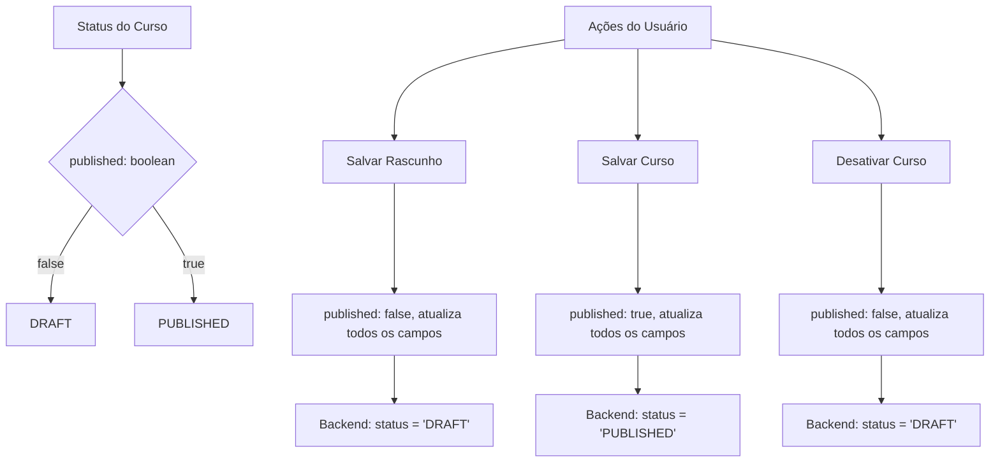
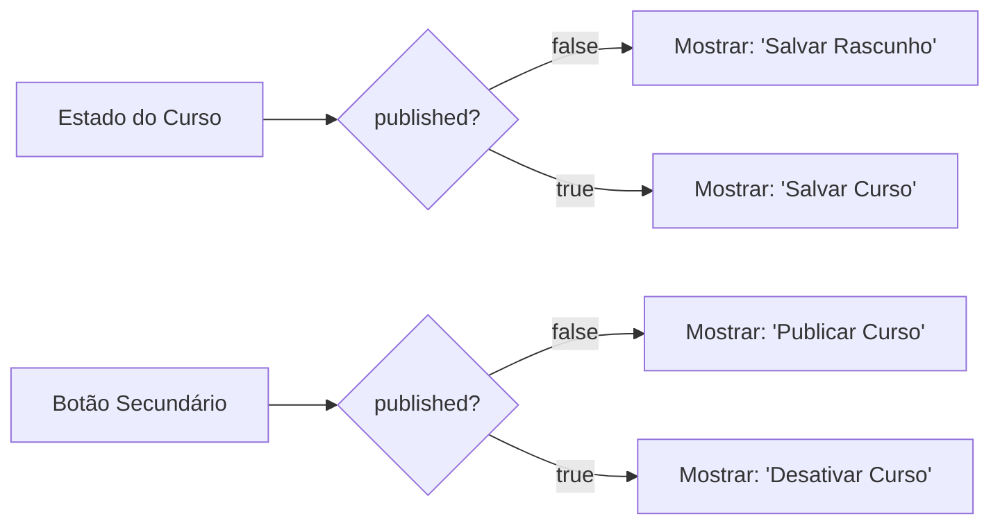

# Atualização da Lógica dos Botões da Página de Editar Cursos

## Visão Geral

Este documento define as alterações necessárias na lógica dos botões "Salvar rascunho" e "Desativar curso" na página de edição de cursos (`/app/admin/courses/[id]/page.tsx`). O objetivo é implementar um comportamento mais intuitivo onde:

1. O botão "Salvar rascunho" aparece apenas quando o curso não está publicado
2. Quando o curso está publicado, o botão muda para "Salvar curso"
3. O botão "Desativar curso" altera o status do curso no banco de dados
4. Ambos os botões salvam todos os campos da tabela com os novos dados preenchidos

## Análise da Implementação Atual

### Estado Atual dos Botões

Atualmente, a página possui dois botões principais no header:

```typescript
// Botão de salvar (linha ~815-819)
<button
  onClick={() => handleSave(false)}
  className="px-4 py-2 text-gray-700 hover:text-gray-900 flex items-center gap-2"
>
  <Save className="w-4 h-4" />
  Salvar Rascunho
</button>

// Botão de publicar/desativar (linha ~820-841)
<button
  onClick={() => handleSave(!watch('published'))}
  className={`px-6 py-2 rounded-lg flex items-center gap-2 ${
    watch('published')
      ? 'bg-yellow-600 text-white hover:bg-yellow-700'
      : 'bg-blue-600 text-white hover:bg-blue-700'
  }`}
>
  {watch('published') ? (
    <EyeOff className="w-4 h-4" />
  ) : (
    <Eye className="w-4 h-4" />
  )}
  {isSaving 
    ? (watch('published') ? 'Desativando...' : 'Publicando...')
    : (watch('published') ? 'Desativar Curso' : 'Publicar Curso')
  }
</button>
```

### Problemas Identificados

1. **Lógica de Exibição Inadequada**: O botão sempre mostra "Salvar Rascunho", independente do status de publicação
2. **Confusão de Nomenclatura**: Quando publicado, deveria mostrar "Salvar curso" em vez de "Salvar Rascunho"
3. **Status do Banco**: O campo `published` (boolean) é mapeado para `status` (enum) no backend

## Arquitetura da Solução

### Mapeamento de Estados



### Lógica de Exibição dos Botões



## Implementação das Alterações

### 1. Atualização da Interface dos Botões

#### Botão Principal (Salvar)

```typescript
// Lógica condicional para o texto do botão
const getSaveButtonText = () => {
  if (isSaving) return 'Salvando...';
  return watch('published') ? 'Salvar Curso' : 'Salvar Rascunho';
};

// Implementação do botão
<button
  onClick={() => handleSaveWithCurrentStatus()}
  disabled={isSaving}
  className="px-4 py-2 text-gray-700 hover:text-gray-900 flex items-center gap-2 disabled:opacity-50"
>
  <Save className="w-4 h-4" />
  {getSaveButtonText()}
</button>
```

#### Botão Secundário (Publicar/Desativar)

```typescript
// Lógica condicional para o botão de publicação/desativação
const getPublishButtonText = () => {
  if (isSaving) {
    return watch('published') ? 'Desativando...' : 'Publicando...';
  }
  return watch('published') ? 'Desativar Curso' : 'Publicar Curso';
};

// Implementação do botão
<button
  onClick={() => handleTogglePublishStatus()}
  disabled={isSaving}
  className={`px-6 py-2 rounded-lg flex items-center gap-2 disabled:opacity-50 ${
    watch('published')
      ? 'bg-yellow-600 text-white hover:bg-yellow-700'
      : 'bg-blue-600 text-white hover:bg-blue-700'
  }`}
>
  {watch('published') ? (
    <EyeOff className="w-4 h-4" />
  ) : (
    <Eye className="w-4 h-4" />
  )}
  {getPublishButtonText()}
</button>
```

### 2. Funções de Manipulação

#### Função para Salvar Mantendo Status Atual

```typescript
const handleSaveWithCurrentStatus = () => {
  const currentData = getValues();
  // Mantém o status atual de publicação
  saveCourse({ ...currentData, published: currentData.published });
};
```

#### Função para Alternar Status de Publicação

```typescript
const handleTogglePublishStatus = () => {
  const currentData = getValues();
  const newPublishedState = !currentData.published;
  // Alterna o status de publicação
  saveCourse({ ...currentData, published: newPublishedState });
};
```

### 3. Atualização do Hook useCourseForm

#### Validação da Função saveCourse

A função `saveCourse` no hook já está corretamente implementada para:
- Mapear `published` (boolean) para `status` (enum) no backend
- Atualizar todos os campos da tabela
- Enviar requisição PUT para o endpoint correto

```typescript
// Em useCourseForm.ts - já implementado corretamente
const saveCourse = useCallback(async (data: CourseFormData) => {
  setIsSaving(true);
  try {
    const payload = {
      ...data,
      status: data.published ? 'PUBLISHED' : 'DRAFT'
    };
    
    delete (payload as any).published;
    
    const response = await fetch(`${API_URL}/courses/${courseId}`, {
      method: 'PUT',
      headers: {
        'Content-Type': 'application/json',
        Authorization: `Bearer ${token}`,
      },
      body: JSON.stringify(payload)
    });
    
    // ... resto da implementação
  } catch (error) {
    onError?.(error as Error);
  } finally {
    setIsSaving(false);
  }
}, [courseId, API_URL, token, onSuccess, onError]);
```

## Comportamento Esperado

### Cenários de Uso

| Estado Atual | Botão Principal | Botão Secundário | Ação do Botão Principal | Ação do Botão Secundário |
|-------------|----------------|------------------|------------------------|--------------------------|
| Rascunho | "Salvar Rascunho" | "Publicar Curso" | Salva como rascunho | Publica o curso |
| Publicado | "Salvar Curso" | "Desativar Curso" | Salva mantendo publicado | Desativa (volta para rascunho) |

### Fluxo de Dados

```mermaid
sequenceD
    participant U as Usuário
    participant F as Frontend
    participant H as Hook useCourseForm
    participant B as Backend API
    participant D as Database
    
    U->>F: Clica em "Salvar Rascunho/Curso"
    F->>H: handleSaveWithCurrentStatus()
    H->>H: getValues() - obtém todos os campos
    H->>H: mantém published atual
    H->>B: PUT /courses/:id com todos os dados
    B->>D: UPDATE course SET ... WHERE id = :id
    D-->>B: Curso atualizado
    B-->>H: Resposta de sucesso
    H-->>F: onSuccess callback
    F-->>U: Toast de sucesso
    
    U->>F: Clica em "Publicar/Desativar Curso"
    F->>H: handleTogglePublishStatus()
    H->>H: getValues() - obtém todos os campos
    H->>H: inverte valor de published
    H->>B: PUT /courses/:id com todos os dados
    B->>D: UPDATE course SET status = 'PUBLISHED'/'DRAFT' WHERE id = :id
    D-->>B: Status atualizado
    B-->>H: Resposta de sucesso
    H-->>F: onSuccess callback
    F-->>U: Toast de confirmação
```

## Validações e Tratamento de Erros

### Validações de Campos

Antes de salvar, o sistema deve validar:
- Campos obrigatórios preenchidos (título, descrição, preço, categoria)
- Formato correto de URLs (thumbnail)
- Valores numéricos válidos (preço, duração)

### Tratamento de Erros

```typescript
const handleSaveWithValidation = async () => {
  try {
    // Validar formulário antes de salvar
    const isValid = await form.trigger();
    if (!isValid) {
      toast.error('Por favor, corrija os erros no formulário antes de salvar.');
      return;
    }
    
    handleSaveWithCurrentStatus();
  } catch (error) {
    console.error('Erro na validação:', error);
    toast.error('Erro ao validar formulário');
  }
};
```

## Melhorias de UX

### Feedback Visual

1. **Estados de Loading**: Botões desabilitados durante salvamento
2. **Indicadores de Status**: Badge visual mostrando status atual
3. **Confirmação de Ações**: Toast messages para feedback

### Acessibilidade

```typescript
// Atributos de acessibilidade
<button
  onClick={handleSaveWithCurrentStatus}
  disabled={isSaving}
  aria-label={watch('published') ? 'Salvar alterações do curso' : 'Salvar curso como rascunho'}
  className="..."
>
  {/* conteúdo do botão */}
</button>
```

## Testes

### Casos de Teste

1. **Teste de Exibição de Botões**
   - Verificar texto correto baseado no status
   - Validar classes CSS aplicadas

2. **Teste de Funcionalidade**
   - Salvar rascunho mantém status DRAFT
   - Salvar curso publicado mantém status PUBLISHED
   - Desativar curso altera para DRAFT
   - Publicar curso altera para PUBLISHED

3. **Teste de Validação**
   - Campos obrigatórios validados antes do salvamento
   - Mensagens de erro apropriadas

### Exemplo de Teste Unitário

```typescript
describe('Course Edit Page Buttons', () => {
  test('should show "Salvar Rascunho" for draft courses', () => {
    const { getByText } = render(<CoursePage />, {
      course: { published: false }
    });
    
    expect(getByText('Salvar Rascunho')).toBeInTheDocument();
    expect(getByText('Publicar Curso')).toBeInTheDocument();
  });
  
  test('should show "Salvar Curso" for published courses', () => {
    const { getByText } = render(<CoursePage />, {
      course: { published: true }
    });
    
    expect(getByText('Salvar Curso')).toBeInTheDocument();
    expect(getByText('Desativar Curso')).toBeInTheDocument();
  });
});
```