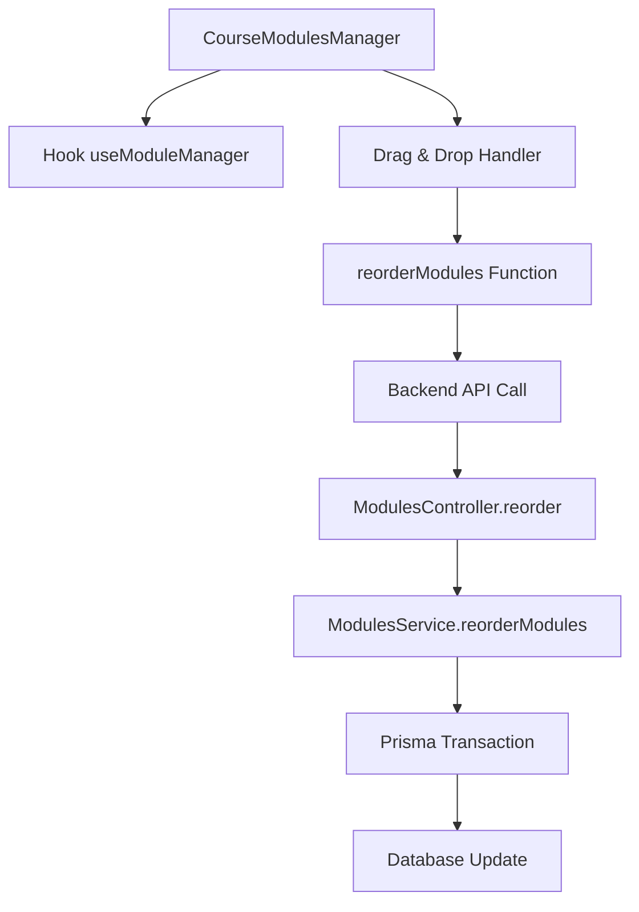
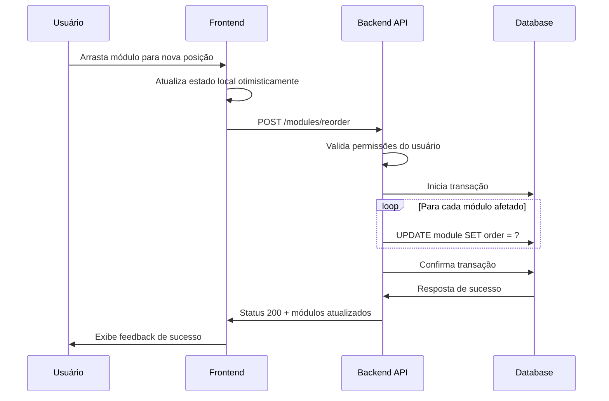

# Sistema de Drag-and-Drop para Reordenação de Módulos com Persistência Automática

## 1. Visão Geral

Este documento detalha a implementação de melhorias no sistema de drag-and-drop para reordenação de módulos de cursos, com foco na persistência automática da nova ordem no backend. O sistema atual permite arrastar e soltar módulos, mas apresenta inconsistências na persistência dos dados, resultando em reset da ordem após recarregamento da página.

### Problema Atual
- O drag-and-drop funciona visualmente no frontend
- A ordem dos módulos não é persistida corretamente no backend
- Após recarregar a página, a ordem retorna ao estado anterior
- Falta de um endpoint específico para reordenação atômica de módulos

### Objetivos
- Implementar persistência automática da ordem dos módulos após drag-and-drop
- Criar endpoint específico para reordenação atômica no backend
- Garantir consistência entre estado do frontend e backend
- Melhorar a experiência do usuário com feedback visual imediato

## 2. Arquitetura da Solução

### Componentes Envolvidos



### Fluxo de Reordenação



## 3. Implementação Backend

### Endpoint de Reordenação

**Rota:** `PATCH /modules/reorder`

**Autenticação:** JWT Bearer Token obrigatório

**Payload:**
```typescript
{
  "modules": [
    { "id": "uuid-modulo-1", "order": 0 },
    { "id": "uuid-modulo-2", "order": 1 },
    { "id": "uuid-modulo-3", "order": 2 }
  ]
}
```

**Resposta de Sucesso:**
```typescript
{
  "success": true,
  "message": "Módulos reordenados com sucesso",
  "modules": [
    {
      "id": "uuid-modulo-1",
      "title": "Módulo 1",
      "order": 0,
      "courseId": "uuid-curso"
    }
    // ... outros módulos
  ]
}
```

### Controller Implementation

```typescript
// modules.controller.ts
@Patch('reorder')
@UseGuards(JwtAuthGuard)
@ApiBearerAuth()
@ApiOperation({ summary: 'Reordenar módulos de um curso' })
@ApiResponse({ status: 200, description: 'Módulos reordenados com sucesso' })
@ApiResponse({ status: 403, description: 'Sem permissão para reordenar' })
@ApiResponse({ status: 400, description: 'Dados inválidos' })
reorder(@Body() reorderModulesDto: ReorderModulesDto, @Request() req) {
  return this.modulesService.reorderModules(
    reorderModulesDto.modules, 
    req.user.id
  );
}
```

### Service Implementation

```typescript
// modules.service.ts
async reorderModules(
  modules: { id: string; order: number }[], 
  userId: string
) {
  if (modules.length === 0) {
    throw new BadRequestException('Lista de módulos não pode estar vazia');
  }

  // Verificar se o primeiro módulo existe e validar permissões
  const firstModule = await this.prisma.module.findUnique({
    where: { id: modules[0].id },
    include: {
      course: true,
    },
  });

  if (!firstModule) {
    throw new NotFoundException('Módulo não encontrado');
  }

  if (firstModule.course.instructorId !== userId) {
    throw new ForbiddenException(
      'Você não tem permissão para reordenar estes módulos'
    );
  }

  // Validar se todos os módulos pertencem ao mesmo curso
  const moduleIds = modules.map(m => m.id);
  const allModules = await this.prisma.module.findMany({
    where: { 
      id: { in: moduleIds },
      courseId: firstModule.courseId 
    }
  });

  if (allModules.length !== modules.length) {
    throw new BadRequestException(
      'Todos os módulos devem pertencer ao mesmo curso'
    );
  }

  // Executar reordenação em transação atômica
  return this.prisma.$transaction(
    modules.map((module) =>
      this.prisma.module.update({
        where: { id: module.id },
        data: { order: module.order },
      }),
    ),
  );
}
```

### DTO Validation

```typescript
// dto/reorder-modules.dto.ts
export class ModuleReorderDto {
  @ApiProperty({ example: 'uuid-do-modulo' })
  @IsString()
  @IsNotEmpty()
  id: string;

  @ApiProperty({ example: 0 })
  @IsNumber()
  @IsInt()
  @Min(0)
  order: number;
}

export class ReorderModulesDto {
  @ApiProperty({ 
    type: [ModuleReorderDto],
    description: 'Lista de módulos com suas novas posições'
  })
  @IsArray()
  @ArrayMinSize(1)
  @ValidateNested({ each: true })
  @Type(() => ModuleReorderDto)
  modules: ModuleReorderDto[];
}
```

## 4. Implementação Frontend

### Hook de Gerenciamento Atualizado

```typescript
// useModuleManager.ts
const reorderModules = useCallback(async (
  startIndex: number, 
  endIndex: number
) => {
  const newModules = Array.from(modules);
  const [removed] = newModules.splice(startIndex, 1);
  newModules.splice(endIndex, 0, removed);

  // Atualizar ordens sequencialmente
  const reorderedModules = newModules.map((module, index) => ({
    ...module,
    order: index,
  }));

  // Atualização otimística do estado local
  setModules(reorderedModules);
  onModulesChange?.(reorderedModules);

  try {
    // Chamar endpoint de reordenação
    const response = await fetch(`${API_URL}/modules/reorder`, {
      method: 'PATCH',
      headers: {
        'Content-Type': 'application/json',
        'Authorization': `Bearer ${token}`,
      },
      body: JSON.stringify({
        modules: reorderedModules.map(({ id, order }) => ({ id, order }))
      }),
    });

    if (!response.ok) {
      throw new Error('Erro ao reordenar módulos');
    }

    const result = await response.json();
    
    // Atualizar com dados do servidor (se necessário)
    if (result.modules) {
      setModules(result.modules);
      onModulesChange?.(result.modules);
    }

    toast.success('Ordem dos módulos atualizada com sucesso!');
  } catch (error) {
    // Em caso de erro, reverter para o estado anterior
    setModules(modules);
    onModulesChange?.(modules);
    
    toast.error('Erro ao salvar a nova ordem. Tente novamente.');
    console.error('Erro na reordenação:', error);
  }
}, [modules, onModulesChange, token]);
```

### Integração com Drag-and-Drop

```typescript
// CourseModulesManager.tsx
const handleDrop = async (
  e: React.DragEvent, 
  targetModuleId: number, 
  targetLessonId?: number
) => {
  e.preventDefault();
  
  if (!draggedItem || draggedItem.type !== 'module' || targetLessonId !== undefined) {
    return;
  }

  const sourceIndex = draggedItem.moduleId;
  const targetIndex = targetModuleId;

  if (sourceIndex === targetIndex) {
    return; // Não houve mudança de posição
  }

  // Chama o hook de reordenação que já inclui persistência
  await reorderModules(sourceIndex, targetIndex);
  
  setDraggedItem(null);
};
```

## 5. Validação e Tratamento de Erros

### Validações no Backend

| Validação | Tipo de Erro | Código HTTP | Mensagem |
|-----------|--------------|-------------|----------|
| Lista vazia | BadRequestException | 400 | "Lista de módulos não pode estar vazia" |
| Módulo não encontrado | NotFoundException | 404 | "Módulo não encontrado" |
| Sem permissão | ForbiddenException | 403 | "Sem permissão para reordenar" |
| Módulos de cursos diferentes | BadRequestException | 400 | "Módulos devem pertencer ao mesmo curso" |
| Ordem duplicada | BadRequestException | 400 | "Ordens devem ser únicas" |

### Tratamento de Erros no Frontend

```typescript
const handleReorderError = (error: Error) => {
  // Reverter estado local para o estado anterior
  setModules(previousModules);
  onModulesChange?.(previousModules);

  // Feedback específico baseado no tipo de erro
  if (error.message.includes('403')) {
    toast.error('Você não tem permissão para reordenar estes módulos');
  } else if (error.message.includes('404')) {
    toast.error('Módulo não encontrado. Recarregue a página.');
  } else {
    toast.error('Erro ao salvar a nova ordem. Tente novamente.');
  }
};
```

## 6. Melhorias na Experiência do Usuário

### Feedback Visual Durante Reordenação

```typescript
const [isReordering, setIsReordering] = useState(false);

const reorderModules = async (...args) => {
  setIsReordering(true);
  
  try {
    // ... lógica de reordenação
    toast.success('Ordem atualizada!', {
      icon: '✅',
      duration: 2000
    });
  } catch (error) {
    // ... tratamento de erro
    toast.error('Erro ao salvar ordem', {
      icon: '❌',
      duration: 3000
    });
  } finally {
    setIsReordering(false);
  }
};
```

### Indicadores de Estado

```typescript
// Visual feedback durante drag
const getDragStyles = (isDragging: boolean, isReordering: boolean) => ({
  opacity: isDragging ? 0.5 : 1,
  cursor: isReordering ? 'wait' : 'grab',
  pointerEvents: isReordering ? 'none' : 'auto',
});
```

## 7. Testes de Integração

### Cenários de Teste

```typescript
describe('Module Reordering', () => {
  test('should persist new order after drag and drop', async () => {
    // 1. Simular drag-and-drop
    // 2. Verificar atualização otimística
    // 3. Confirmar persistência no backend
    // 4. Validar consistência após reload
  });

  test('should handle reorder errors gracefully', async () => {
    // 1. Simular erro na API
    // 2. Verificar reversão do estado
    // 3. Confirmar feedback de erro
  });

  test('should validate permissions before reordering', async () => {
    // 1. Tentar reordenar sem permissão
    // 2. Verificar erro 403
    // 3. Confirmar que ordem não mudou
  });
});
```

## 8. Performance e Otimizações

### Debounce para Múltiplas Operações

```typescript
const debouncedReorder = useCallback(
  debounce(async (modules: Module[]) => {
    await reorderModules(modules);
  }, 300),
  []
);
```

### Cache de Estado Anterior

```typescript
const [previousModules, setPreviousModules] = useState<Module[]>([]);

useEffect(() => {
  setPreviousModules([...modules]);
}, [modules]);
```

## 9. Considerações de Segurança

### Validação de Autorização
- Verificar se usuário é instrutor do curso
- Validar se todos módulos pertencem ao mesmo curso
- Implementar rate limiting para prevenir spam

### Integridade dos Dados
- Usar transações atômicas no banco
- Validar unicidade das ordens
- Implementar rollback em caso de falha parcial

## 10. Monitoramento e Logging

### Métricas Importantes
- Taxa de sucesso das reordenações
- Tempo médio de resposta da API
- Frequência de reversões por erro

### Logs Estruturados
```typescript
logger.info('Module reorder initiated', {
  userId,
  courseId: firstModule.courseId,
  modulesCount: modules.length,
  timestamp: new Date().toISOString()
});
```