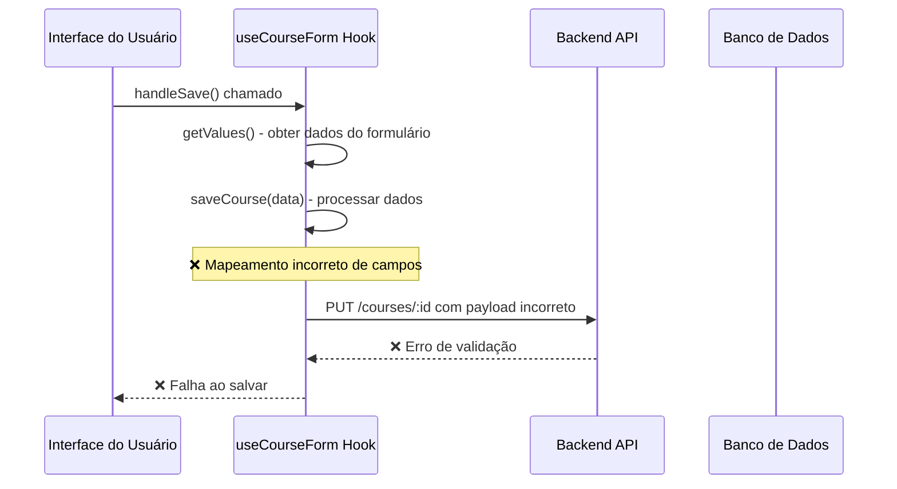
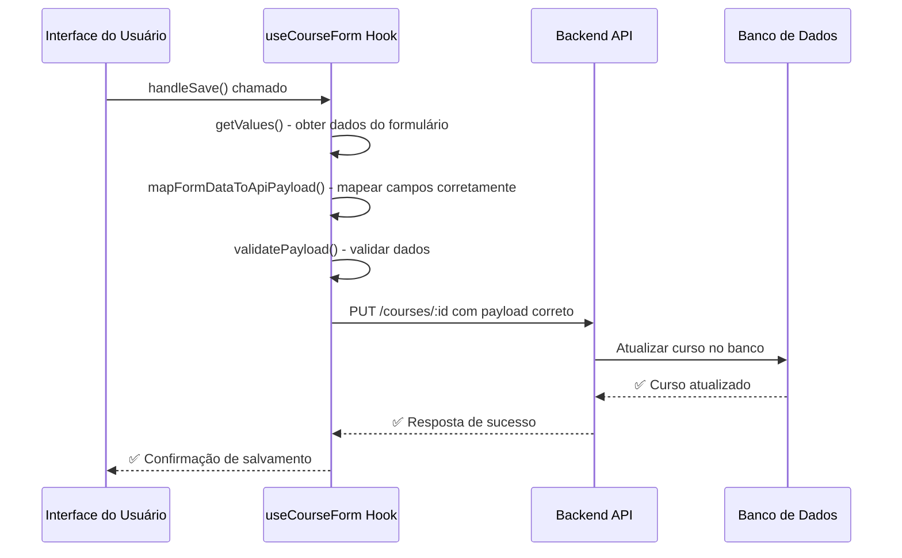

# Correção do Botão "Salvar Dados" na Página de Edição de Curso

## Visão Geral

A página de edição de curso apresenta um problema específico no botão "Salvar dados", onde os dados não estão sendo salvos corretamente no banco de dados. Esta análise identifica e corrige o problema de mapeamento entre os dados do frontend e a API do backend.

## Problema Identificado

### Análise do Problema

O botão "Salvar dados" na página de edição de curso (`app/admin/courses/[id]/page.tsx`) não consegue salvar os dados corretamente devido a incompatibilidades entre o payload enviado pelo frontend e os campos esperados pela API do backend.

#### Problemas Específicos Identificados:

1. **Mapeamento de Categoria Incorreto**: O frontend envia `category` como string UUID, mas o backend espera `categoryId`
2. **Campo `published` vs `status`**: O frontend trabalha com boolean `published`, mas o backend espera enum `status`
3. **Validação de Dados**: Falta de validação adequada antes do envio dos dados

### Fluxo Atual Problemático



## Arquitetura da Solução

### Componentes Afetados

1. **Frontend Hook** (`useCourseForm.ts`): Lógica de mapeamento de dados
2. **Backend DTO** (`UpdateCourseDto`): Validação de entrada
3. **Interface de Usuário** (`page.tsx`): Feedback de erro

### Fluxo Corrigido



## Correções Necessárias

### 1. Correção do Mapeamento de Dados

#### Problema no Hook `useCourseForm.ts`

```typescript
// ❌ Implementação atual problemática
const saveCourse = useCallback(async (data: CourseFormData) => {
  const payload = {
    ...validatedData,
    status: validatedData.published ? 'PUBLISHED' : 'DRAFT'
  };
  delete (payload as any).published;
  // ❌ Campo 'category' não está sendo mapeado para 'categoryId'
}, []);
```

#### ✅ Implementação Corrigida

```typescript
const saveCourse = useCallback(async (data: CourseFormData) => {
  setIsSaving(true);
  try {
    // Validar dados com schema de rascunho
    const validatedData = courseFormSchemaDraft.parse(data);
    
    // ✅ Mapear dados corretamente para API
    const payload = {
      title: validatedData.title,
      description: validatedData.description || '',
      price: validatedData.price || 0,
      categoryId: validatedData.category, // ✅ Mapear category -> categoryId
      thumbnail: validatedData.thumbnail || '',
      level: validatedData.level,
      duration: validatedData.duration || 0,
      status: validatedData.published ? 'PUBLISHED' : 'DRAFT' // ✅ Mapear published -> status
    };
    
    console.log('Payload mapeado para API:', payload);
    
    const url = courseId === 'new' ? `${API_URL}/courses` : `${API_URL}/courses/${courseId}`;
    const method = courseId === 'new' ? 'POST' : 'PUT';
    
    const response = await fetch(url, {
      method,
      headers: {
        'Content-Type': 'application/json',
        Authorization: `Bearer ${token}`,
      },
      body: JSON.stringify(payload)
    });

    if (!response.ok) {
      const errorData = await response.json().catch(() => ({}));
      throw new Error(errorData.message || 'Erro ao salvar curso');
    }
    
    const savedCourse = await response.json();
    
    // ✅ Atualizar dados do formulário com resposta da API
    if (savedCourse) {
      form.setValue('published', savedCourse.status === 'PUBLISHED');
    }
    
    onSuccess?.(savedCourse);
  } catch (error) {
    console.error('Erro detalhado ao salvar:', error);
    if (error instanceof z.ZodError) {
      const errorMessages = error.errors.map(err => 
        `${err.path.join('.')}: ${err.message}`
      ).join(', ');
      onError?.(new Error(`Erro de validação: ${errorMessages}`));
    } else {
      onError?.(error as Error);
    }
  } finally {
    setIsSaving(false);
  }
}, [courseId, API_URL, token, form, onSuccess, onError]);
```

### 2. Melhorar Tratamento de Erros

#### ✅ Implementação de Tratamento de Erros Robusto

```typescript
// Função auxiliar para processar erros da API
const handleApiError = (error: any): Error => {
  if (error instanceof z.ZodError) {
    const messages = error.errors.map(err => 
      `${err.path.join('.')}: ${err.message}`
    ).join(', ');
    return new Error(`Validação: ${messages}`);
  }
  
  if (error.response?.data?.message) {
    return new Error(error.response.data.message);
  }
  
  if (error.message) {
    return new Error(error.message);
  }
  
  return new Error('Erro desconhecido ao salvar curso');
};
```

### 3. Validação de Dados Aprimorada

#### ✅ Schema de Validação Atualizado

```typescript
// Atualizar schema para validar campo categoryId
const courseFormSchemaDraft = z.object({
  title: z.string().min(1, 'Título é obrigatório').max(100),
  description: z.string().optional().or(z.literal('')),
  price: z.number().min(0).max(9999.99).multipleOf(0.01).optional(),
  category: z.string()
    .min(1, 'Categoria é obrigatória')
    .uuid('Categoria deve ser um ID válido'), // ✅ Validar UUID
  thumbnail: z.string().optional().or(z.literal('')),
  published: z.boolean().default(false),
  level: z.enum(['BEGINNER', 'INTERMEDIATE', 'ADVANCED']),
  duration: z.number().min(0).max(10080).optional().or(z.literal(0)),
  modules: z.array(z.object({
    id: z.string(),
    title: z.string().optional().or(z.literal('')),
    description: z.string().optional().or(z.literal('')),
    lessons: z.array(z.object({
      id: z.string(),
      title: z.string().optional().or(z.literal('')),
      videoUrl: z.string().optional().or(z.literal('')),
      duration: z.number().optional().default(0)
    })).optional().default([])
  })).optional().default([])
});
```

## Implementação

### Arquivos a Modificar

1. **`app/admin/courses/[id]/hooks/useCourseForm.ts`**
   - Corrigir função `saveCourse`
   - Melhorar mapeamento de dados
   - Aprimorar tratamento de erros

### Testes de Validação

#### Cenários de Teste

1. **Salvar curso com dados completos**
   - Título, descrição, preço, categoria, thumbnail
   - Verificar se todos os campos são salvos corretamente

2. **Salvar curso com dados parciais** 
   - Apenas título e categoria (campos obrigatórios)
   - Verificar se salva como rascunho

3. **Validação de erros**
   - Campo categoria vazio
   - Preço negativo
   - Título muito longo

4. **Feedback visual**
   - Estado de loading durante salvamento
   - Mensagem de sucesso após salvamento
   - Mensagem de erro em caso de falha

### Validação dos Dados

#### Estrutura de Dados Esperada pela API

```typescript
interface CourseUpdatePayload {
  title: string;
  description: string;
  price: number;
  categoryId: string; // ✅ Campo correto esperado pela API
  thumbnail?: string;
  level: 'BEGINNER' | 'INTERMEDIATE' | 'ADVANCED';
  duration?: number;
  status: 'DRAFT' | 'PUBLISHED'; // ✅ Campo correto esperado pela API
}
```

#### Mapeamento Frontend -> Backend

```typescript
const mapFormToApi = (formData: CourseFormData): CourseUpdatePayload => ({
  title: formData.title,
  description: formData.description || '',
  price: formData.price || 0,
  categoryId: formData.category, // category -> categoryId
  thumbnail: formData.thumbnail || '',
  level: formData.level,
  duration: formData.duration || 0,
  status: formData.published ? 'PUBLISHED' : 'DRAFT' // published -> status
});
```

## Resultados Esperados

Após a implementação das correções:

1. **✅ Dados salvos corretamente**: Todos os campos do formulário são persistidos no banco
2. **✅ Feedback adequado**: Usuário recebe confirmação visual do salvamento
3. **✅ Tratamento de erros**: Mensagens claras em caso de falha
4. **✅ Validação robusta**: Dados são validados antes do envio
5. **✅ Compatibilidade API**: Payload enviado está alinhado com backend