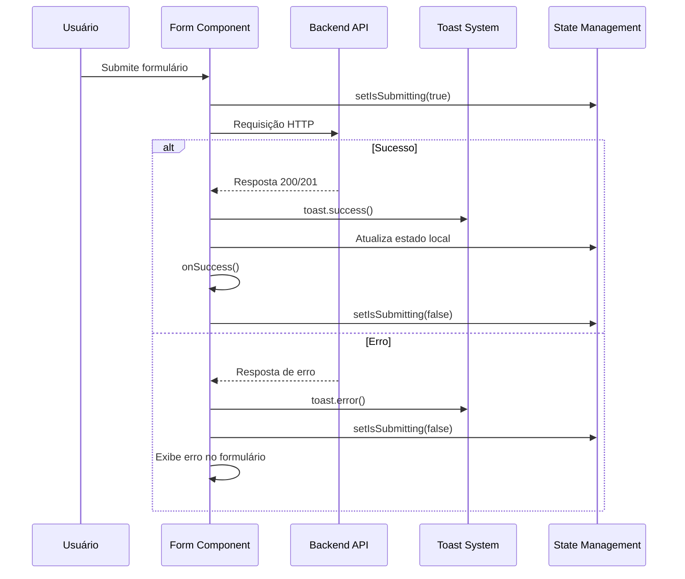

# Design: Correção de Congelamento da Página Após Salvar Usuário

## Visão Geral

Este documento descreve o design para resolver o problema de congelamento da interface após salvar (criar ou editar) usuários no painel administrativo. O problema ocorre quando o Promise dentro do `toast.promise` não é resolvido adequadamente, causando travamento na interface.

## Problema Identificado

### Descrição do Problema
Após salvar um usuário (criar novo ou editar existente), a página congela e não responde a interações do usuário, impossibilitando clicks e navegação.

### Localização dos Problemas
- **UserCreateForm**: `components/admin/user-create-form.tsx` - linhas 55-81  
- **UserEditForm**: `components/admin/user-edit-form.tsx` - linhas 169-186

### Análise das Causas

#### 1. Promise Handling Inadequado
```typescript
// Problema atual no UserEditForm
toast.promise(promise, {
  loading: "Salvando alterações...",
  success: async () => {
    await reloadUser();
    onSuccess();
    return "Usuário atualizado com sucesso!";
  },
  error: (err) => {
    form.setError("root", { message: err.message });
    return err.message;
  },
  finally: () => {
    setIsSubmitting(false);
  },
});
```

**Problemas identificados:**
- O `finally` dentro do `toast.promise` não funciona corretamente
- Callbacks assíncronos dentro do `success` podem causar inconsistências
- Falta de tratamento adequado de erros que podem manter o estado `isSubmitting`

#### 2. Estado de Loading Bloqueado
```typescript
// UserCreateForm - linha 49
setIsLoading(true);
// Sem garantia de que será resetado em caso de erro
```

#### 3. Dependências de Promise Encadeadas
- `reloadUser()` assíncrono dentro do `success` callback
- `onSuccess()` executado antes da conclusão completa

## Arquitetura da Solução

### Fluxo de Dados Corrigido



### Componentes Afetados

#### 1. UserCreateForm (`components/admin/user-create-form.tsx`)
**Problemas:**
- Promise handling manual inadequado
- Estado `isLoading` pode não ser resetado

#### 2. UserEditForm (`components/admin/user-edit-form.tsx`)
- `toast.promise` com callbacks assíncronos problemáticos
- `finally` não funcional
- Estado `isSubmitting` pode permanecer travado

#### 3. UsersPage (`app/admin/users/page.tsx`)
- Dependência do callback `onSuccess` para refresh da lista

## Implementação da Solução

### 1. Correção do UserCreateForm

```typescript
const handleSubmit = async (e: React.FormEvent) => {
  e.preventDefault();
  setIsLoading(true);
  setError(null);

  try {
    const sequencial = 1;
    const studentCode = generateStudentCode(userRole, sequencial);

    const response = await fetch(`${process.env.NEXT_PUBLIC_API_URL}/users`, {
      method: "POST",
      headers: {
        "Content-Type": "application/json",
        Authorization: `Bearer ${token}`,
      },
      body: JSON.stringify({
        name,
        email,
        password,
        cpf,
        role: userRole,
        studentCode,
      }),
    });

    if (!response.ok) {
      const errorData = await response.json().catch(() => ({ message: 'Falha ao criar usuário' }));
      throw new Error(errorData.message || 'Falha ao criar usuário');
    }

    const data = await response.json();
    
    toast.success(`Usuário criado com sucesso! Código: ${studentCode}`);
    onSuccess();
    
  } catch (error) {
    const errorMessage = error instanceof Error ? error.message : 'Erro desconhecido';
    setError(errorMessage);
    toast.error(errorMessage);
  } finally {
    setIsLoading(false);
  }
};
```

### 2. Correção do UserEditForm

```typescript
async function onSubmit(values: z.infer<typeof formSchema>) {
  setIsSubmitting(true);

  try {
    const formData = new FormData();

    // Anexa o arquivo de avatar se existir
    if (values.avatar) {
      formData.append('file', values.avatar);
    }

    // Anexa outros campos de texto
    formData.append('name', values.name);
    formData.append('email', values.email);
    formData.append('role', values.role);
    
    if (values.bio) {
      formData.append('bio', values.bio);
    }

    if (values.cpf) {
      formData.append('cpf', values.cpf.replace(/\D/g, ''));
    }

    if (values.password) {
      formData.append('password', values.password);
    }

    const response = await fetch(`${process.env.NEXT_PUBLIC_BACKEND_BASE_URL}/api/users/${user.id}`, {
      method: "PATCH",
      headers: {
        Authorization: `Bearer ${token}`,
      },
      body: formData,
    });

    if (!response.ok) {
      const errorData = await response.json().catch(() => ({ message: 'Falha ao atualizar os dados do usuário.' }));
      throw new Error(errorData.message || 'Falha ao atualizar os dados do usuário.');
    }

    const updatedUser = await response.json();
    
    // Executa ações pós-sucesso
    await reloadUser();
    toast.success("Usuário atualizado com sucesso!");
    onSuccess();
    
  } catch (error) {
    const errorMessage = error instanceof Error ? error.message : 'Erro desconhecido';
    form.setError("root", { message: errorMessage });
    toast.error(errorMessage);
  } finally {
    setIsSubmitting(false);
  }
}
```

### 3. Melhorias de UX

#### Loading States Visuais
```typescript
// UserCreateForm
<Button type="submit" disabled={isLoading}>
  {isLoading ? (
    <>
      <LoaderIcon className="mr-2 h-4 w-4 animate-spin" />
      Salvando...
    </>
  ) : (
    "Salvar"
  )}
</Button>

// UserEditForm  
<Button type="submit" disabled={isSubmitting}>
  {isSubmitting ? (
    <>
      <LoaderIcon className="mr-2 h-4 w-4 animate-spin" />
      Salvando...
    </>
  ) : (
    "Salvar Alterações"
  )}
</Button>
```

#### Overlay de Loading para Modais
```typescript
{isSubmitting && (
  <div className="absolute inset-0 bg-black/20 flex items-center justify-center z-50">
    <div className="bg-white p-4 rounded-lg shadow-lg flex items-center gap-2">
      <LoaderIcon className="h-4 w-4 animate-spin" />
      <span>Salvando...</span>
    </div>
  </div>
)}
```

## Validação da Solução

### Critérios de Teste

#### 1. Teste de Criação de Usuário
- [ ] Formulário não congela após submit bem-sucedido
- [ ] Modal fecha automaticamente após sucesso
- [ ] Lista de usuários é atualizada
- [ ] Toast de sucesso é exibido
- [ ] Em caso de erro, formulário permanece responsivo

#### 2. Teste de Edição de Usuário
- [ ] Formulário não congela após submit bem-sucedido
- [ ] Modal fecha automaticamente após sucesso
- [ ] Dados do usuário são atualizados na tela
- [ ] Toast de sucesso é exibido
- [ ] Context de autenticação é recarregado (se necessário)

#### 3. Teste de Tratamento de Erros
- [ ] Erros de rede são tratados adequadamente
- [ ] Formulário permanece responsivo após erro
- [ ] Mensagens de erro são exibidas corretamente
- [ ] Estado de loading é resetado após erro

### Casos de Teste

```typescript
// Teste: Submit bem-sucedido
describe('UserCreateForm - Submit Success', () => {
  it('should not freeze page after successful submit', async () => {
    // Arrange: Form with valid data
    // Act: Submit form
    // Assert: Page remains responsive, modal closes, toast shows
  });
});

// Teste: Submit com erro
describe('UserCreateForm - Submit Error', () => {
  it('should handle errors gracefully without freezing', async () => {
    // Arrange: Form with data that will cause error
    // Act: Submit form
    // Assert: Error shown, form still responsive, loading state reset
  });
});
```

## Impacto e Benefícios

### Performance
- **Eliminação de promisses pendentes** que causam travamento
- **Gerenciamento adequado de estado** de loading/submitting  
- **Redução de memory leaks** por promises não resolvidas

### Experiência do Usuário
- **Interface sempre responsiva** durante operações
- **Feedback visual claro** do status das operações
- **Recuperação adequada** de situações de erro
- **Fluxo mais fluido** de criação/edição de usuários

### Manutenibilidade
- **Código mais legível** com async/await em vez de promise chains
- **Tratamento de erro centralizado** e consistente
- **Estados bem definidos** para cada operação
- **Facilidade para adicionar novos recursos** sem introduzir bugs similares
