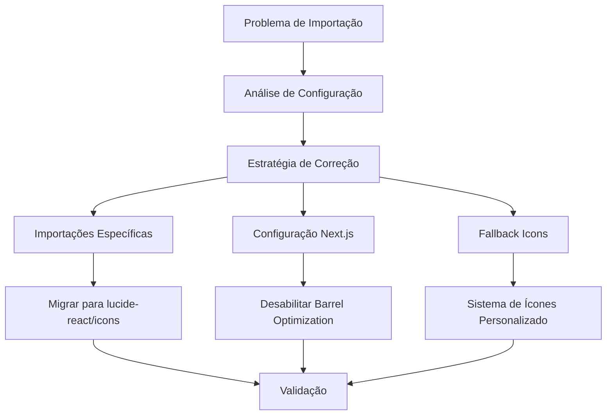

# Correção de Importações de Ícones do Lucide React

## Overview

Este documento aborda a resolução dos erros de importação de ícones do Lucide React que estão ocorrendo devido à otimização de barrel (`__barrel_optimize__`) do Next.js. O problema afeta múltiplos componentes da aplicação, incluindo layouts administrativos, componentes UI e formulários.

## Problema Identificado

### Descrição do Erro
```
Attempted import error: 'ShieldAlert' is not exported from '__barrel_optimize__?names=BarChart3,BookOpen,ChevronDown,FileText,GraduationCap,LayoutDashboard,LogOut,Menu,Settings,ShieldAlert,Tag,Users,X!=!lucide-react'
```

### Causa Raiz
- Next.js 13.5.6 com otimização de barrel automática interfere nas exportações do Lucide React
- A configuração `experimental.optimizePackageImports` no `next.config.js` não está funcionando adequadamente
- Importações em lote do Lucide React estão sendo otimizadas incorretamente

### Arquivos Afetados
- `app/admin/layout.tsx` - 13 ícones afetados
- `components/ui/select.tsx` - 3 ícones afetados  
- 25+ outros arquivos TSX com importações do Lucide React

## Arquitetura da Solução

### Estratégia de Resolução



### Abordagens de Solução

#### 1. Migração para Importações Específicas
- Alterar importações de `lucide-react` para `lucide-react/icons/[icon-name]`
- Manter compatibilidade com versão atual do Lucide React (0.541.0)
- Garantir tree-shaking adequado

#### 2. Configuração Next.js Aprimorada
- Refinamento da configuração `optimizePackageImports`
- Exclusão explícita de Lucide React da barrel optimization
- Configuração de transpilation adequada

#### 3. Sistema de Ícones Centralizado
- Criação de um módulo de ícones centralizado
- Mapeamento de ícones utilizados no projeto
- Fallbacks para ícones não encontrados

## Design de Implementação

### Módulo de Ícones Centralizado

```typescript
// lib/icons.ts
export interface IconComponent {
  (props: { className?: string; size?: number }): JSX.Element;
}

export const Icons: Record<string, IconComponent> = {
  LayoutDashboard: dynamic(() => import('lucide-react/icons/layout-dashboard')),
  Users: dynamic(() => import('lucide-react/icons/users')),
  BookOpen: dynamic(() => import('lucide-react/icons/book-open')),
  // ... outros ícones
};
```

### Configuração Next.js Otimizada

```javascript
// next.config.js
const nextConfig = {
  experimental: {
    optimizePackageImports: false, // Desabilitar para Lucide React
  },
  
  webpack: (config) => {
    config.resolve.alias = {
      ...config.resolve.alias,
      'lucide-react': require.resolve('lucide-react/dist/esm/index.js'),
    };
    return config;
  },
};
```

### Hook de Ícones Dinâmicos

```typescript
// hooks/use-icon.ts
export function useIcon(iconName: string): IconComponent | null {
  const [Icon, setIcon] = useState<IconComponent | null>(null);
  
  useEffect(() => {
    const loadIcon = async () => {
      try {
        const module = await import(`lucide-react/icons/${iconName.toLowerCase()}`);
        setIcon(() => module.default);
      } catch (error) {
        console.warn(`Ícone ${iconName} não encontrado`);
        setIcon(null);
      }
    };
    
    loadIcon();
  }, [iconName]);
  
  return Icon;
}
```

## Estratégia de Migração

### Fase 1: Configuração Base
1. Atualizar `next.config.js` com configurações otimizadas
2. Criar módulo centralizado de ícones
3. Implementar sistema de fallback

### Fase 2: Migração de Componentes Críticos
1. `app/admin/layout.tsx` - Componente principal do admin
2. `components/ui/select.tsx` - Componente base reutilizado
3. Componentes de formulário administrativo

### Fase 3: Migração Sistemática
1. Componentes de interface (`components/ui/`)
2. Páginas administrativas (`app/admin/`)
3. Componentes de curso (`components/admin/CourseModulesManager/`)

### Fase 4: Validação e Otimização
1. Testes de carregamento de ícones
2. Verificação de tree-shaking
3. Performance de importação dinâmica

## Componentes de Interface

### Wrapper de Ícones Universal

```typescript
// components/ui/icon.tsx
interface IconProps {
  name: string;
  className?: string;
  size?: number;
  fallback?: React.ComponentType;
}

export function Icon({ name, className, size = 16, fallback }: IconProps) {
  const IconComponent = useIcon(name);
  
  if (!IconComponent && fallback) {
    const FallbackComponent = fallback;
    return <FallbackComponent className={className} />;
  }
  
  if (!IconComponent) {
    return <div className={cn("w-4 h-4 bg-gray-300", className)} />;
  }
  
  return <IconComponent className={className} size={size} />;
}
```

### Migração de Layout Administrativo

```typescript
// app/admin/layout.tsx - Versão Migrada
import { Icon } from "@/components/ui/icon";

const menuGroups: MenuGroup[] = [
  {
    label: "Administração",
    items: [
      { icon: "LayoutDashboard", label: "Dashboard", href: "/admin" },
      { icon: "Users", label: "Usuários", href: "/admin/users" },
      { icon: "BarChart3", label: "Analytics", href: "/admin/analytics" },
    ]
  },
  // ...
];

// No componente
<Icon name={item.icon} className="h-5 w-5" />
```

## Implementação Prática - Passos Executáveis

> 🔥 **IMPORTANTE**: Execute os passos na ordem exata apresentada. Pare o servidor de desenvolvimento antes de começar!

### 📌 Pré-requisitos

1. **Parar o servidor de desenvolvimento:**
   ```bash
   # Pressione Ctrl+C no terminal onde npm run dev está executando
   ```

2. **Fazer backup (opcional mas recomendado):**
   ```bash
   git add .
   git commit -m "backup antes da correção dos ícones"
   ```

### 🔧 Passo 1: Atualizar next.config.js

**Ação**: Substituir a configuração experimental no arquivo `next.config.js`

**Localização**: `d:\Windows\GitHub\Plataform-de-curso-gor\next.config.js`

**Substituir:**
```javascript
// Correção para problemas de barrel optimization do Lucide React
experimental: {
  optimizePackageImports: ['lucide-react']
},
```

**Por:**
```javascript
// Correção para problemas de barrel optimization do Lucide React
experimental: {
  optimizePackageImports: false // Desabilitar para evitar conflitos
},

// Configuração webpack para resolver importações do Lucide React
webpack: (config, { isServer }) => {
  // Resolver alias para Lucide React
  config.resolve.alias = {
    ...config.resolve.alias,
    'lucide-react': require.resolve('lucide-react'),
  };
  
  return config;
},
```

### 🔧 Passo 2: Criar Sistema de Ícones Centralizado

**Ação**: Criar o arquivo `lib/icons.ts`

**Localização**: `d:\Windows\GitHub\Plataform-de-curso-gor\lib\icons.ts`

**Conteúdo:**
```typescript
import { 
  LayoutDashboard,
  Users,
  BarChart3,
  BookOpen,
  Tag,
  Settings,
  Menu,
  X,
  ShieldAlert,
  LogOut,
  ChevronDown,
  ChevronUp,
  Check,
  FileText,
  GraduationCap,
  Plus,
  Loader2,
  MoreHorizontal,
  Edit,
  Trash2,
  Upload,
  GripVertical,
  Eye,
  EyeOff,
  Star,
  Clock,
  Play,
  Award,
  TrendingUp,
  Pencil,
  Save,
  Facebook,
  Twitter,
  Instagram,
  Youtube,
  Mail,
  Phone,
  MapPin,
  ShoppingCart,
  Gift,
  Bookmark,
  ChevronRight
} from 'lucide-react';

export interface IconComponent {
  (props: { className?: string; size?: number; [key: string]: any }): JSX.Element;
}

// Mapeamento centralizado de ícones
export const Icons: Record<string, IconComponent> = {
  // Administração
  LayoutDashboard,
  Users,
  BarChart3,
  Settings,
  ShieldAlert,
  
  // Navegação
  Menu,
  X,
  ChevronDown,
  ChevronUp,
  ChevronRight,
  
  // Cursos e Educação
  BookOpen,
  GraduationCap,
  FileText,
  Tag,
  
  // Ações
  Plus,
  Edit,
  Trash2,
  Save,
  Upload,
  Eye,
  EyeOff,
  LogOut,
  Check,
  
  // Interface
  Loader2,
  MoreHorizontal,
  GripVertical,
  Pencil,
  
  // Conteúdo
  Star,
  Clock,
  Play,
  Award,
  TrendingUp,
  
  // Social
  Facebook,
  Twitter,
  Instagram,
  Youtube,
  Mail,
  Phone,
  MapPin,
  
  // E-commerce
  ShoppingCart,
  Gift,
  Bookmark,
};

// Função utilitária para obter ícone com fallback
export function getIcon(name: string): IconComponent | null {
  return Icons[name] || null;
}

// Lista de todos os ícones disponíveis
export const availableIcons = Object.keys(Icons);
```

### 🔧 Passo 3: Corrigir Importações no Layout Admin

**Ação**: Atualizar `app/admin/layout.tsx`

**Localização**: `d:\Windows\GitHub\Plataform-de-curso-gor\app\admin\layout.tsx`

**Substituir as importações na parte superior do arquivo:**
```typescript
// REMOVER estas linhas:
import { 
  LayoutDashboard, 
  Users, 
  BookOpen, 
  Tag, 
  BarChart3, 
  Settings,
  Menu,
  X,
  ShieldAlert,
  ShoppingCart,
  FileText,
  Gift,
  Bookmark,
  GraduationCap,
  LogOut,
  ChevronDown
} from "lucide-react";

// ADICIONAR esta linha:
import { Icons } from "@/lib/icons";
```

**Atualizar a interface MenuItem:**
```typescript
interface MenuItem {
  icon: string; // Mudou de React.ComponentType para string
  label: string;
  href: string;
  subItems?: MenuItem[];
}
```

**Atualizar menuGroups:**
```typescript
const menuGroups: MenuGroup[] = [
  {
    label: "Administração",
    items: [
      { icon: "LayoutDashboard", label: "Dashboard", href: "/admin" },
      { icon: "Users", label: "Usuários", href: "/admin/users" },
      { icon: "BarChart3", label: "Analytics", href: "/admin/analytics" },
    ]
  },
  {
    label: "Produtos",
    items: [
      { 
        icon: "BookOpen", 
        label: "Cursos", 
        href: "/admin/courses",
        subItems: [
          { icon: "BookOpen", label: "Todos os Cursos", href: "/admin/courses" },
          { icon: "Tag", label: "Categorias", href: "/admin/categories" },
          { icon: "GraduationCap", label: "Aulas", href: "/admin/lessons" },
          { icon: "FileText", label: "Certificados", href: "/admin/certificates" },
        ]
      },
    ]
  },
  {
    items: [
      { icon: "Settings", label: "Configurações", href: "/admin/settings" },
      { icon: "LogOut", label: "Sair", href: "/logout" },
    ]
  }
];
```

**Atualizar o uso dos ícones no JSX:**
```typescript
// Na linha onde ShieldAlert é usado:
{Icons.ShieldAlert && <Icons.ShieldAlert className="h-5 w-5 animate-spin" />}

// Na linha do botão menu:
{sidebarOpen ? 
  (Icons.X && <Icons.X size={20} />) : 
  (Icons.Menu && <Icons.Menu size={20} />)
}

// No botão de item do menu:
<div className="flex items-center justify-center w-5 h-5">
  {Icons[item.icon] && React.createElement(Icons[item.icon], { className: "h-5 w-5" })}
</div>
```

### 🔧 Passo 4: Corrigir components/ui/select.tsx

**Ação**: Atualizar importações no arquivo `components/ui/select.tsx`

**Localização**: `d:\Windows\GitHub\Plataform-de-curso-gor\components\ui\select.tsx`

**Substituir:**
```typescript
// REMOVER:
import { Check, ChevronDown, ChevronUp } from 'lucide-react';

// ADICIONAR:
import { Icons } from '@/lib/icons';
```

**Atualizar o uso no código:**
```typescript
// Substituir todas as ocorrências:
<ChevronDown className="h-4 w-4 opacity-50" />
// Por:
<Icons.ChevronDown className="h-4 w-4 opacity-50" />

<ChevronUp className="h-4 w-4" />
// Por:
<Icons.ChevronUp className="h-4 w-4" />

<Check className="h-4 w-4" />
// Por:
<Icons.Check className="h-4 w-4" />
```

### 🔧 Passo 5: Testar a Solução

**Comandos para executar:**

1. **Parar o servidor de desenvolvimento** (Ctrl+C)

2. **Limpar cache do Next.js:**
```bash
rm -rf .next
# ou no Windows:
rmdir /s .next
```

3. **Reinstalar dependências (opcional mas recomendado):**
```bash
npm install
```

4. **Iniciar novamente:**
```bash
npm run dev
```

### 🔧 Passo 6: Migração Sistemática dos Demais Arquivos

**Lista de arquivos prioritários para migração:**

1. `app/admin/page.tsx`
2. `app/admin/courses/page.tsx`
3. `components/admin/course-create-modal.tsx`
4. `app/login/page.tsx`
5. `app/register/page.tsx`

**Para cada arquivo:**
- Remover importações do `lucide-react`
- Adicionar `import { Icons } from '@/lib/icons'`
- Substituir uso direto dos ícones por `Icons.NomeDoIcone`

### ✅ Critérios de Validação

**Verificar se:**
- [ ] Build executa sem erros de importação
- [ ] Todos os ícones são exibidos corretamente
- [ ] Não há erros de `__barrel_optimize__` no console
- [ ] Performance de carregamento mantida

### 🚨 Troubleshooting

**Se ainda houver erros:**

1. **Verificar cache do navegador** - Force refresh (Ctrl+Shift+R)
2. **Verificar se todos os ícones estão no arquivo icons.ts**
3. **Verificar se não há importações diretas restantes do lucide-react**
4. **Limpar node_modules se necessário:**
   ```bash
   rm -rf node_modules package-lock.json
   npm install
   ```

## Configuração de Ambiente

### Dependências Necessárias
- `lucide-react: ^0.541.0` (mantida)
- `next: 13.5.6` (com configuração aprimorada)
- Sem dependências adicionais necessárias

### Variáveis de Ambiente
- Nenhuma variável adicional necessária
- Configuração baseada em arquivos de configuração

## Testing Strategy

### Testes de Importação
```typescript
// __tests__/icons.test.tsx
describe('Icon System', () => {
  test('should load common icons', async () => {
    const icon = await import('lucide-react/icons/layout-dashboard');
    expect(icon.default).toBeDefined();
  });
  
  test('should handle missing icons gracefully', () => {
    render(<Icon name="non-existent-icon" />);
    // Verificar fallback
  });
});
```

### Testes de Performance
- Medição de tempo de carregamento de ícones
- Verificação de lazy loading adequado
- Análise de bundle size

## Monitoramento e Observabilidade

### Métricas de Erro
- Rastreamento de ícones não encontrados
- Tempo de carregamento de importações dinâmicas
- Taxa de sucesso de carregamento de ícones

### Logging
```typescript
// utils/icon-logger.ts
export function logIconUsage(iconName: string, success: boolean) {
  if (process.env.NODE_ENV === 'development') {
    console.log(`Icon ${iconName}: ${success ? 'loaded' : 'failed'}`);
  }
}
```

## Compatibilidade e Migração

### Backward Compatibility
- Manter interface de ícones existente
- Suporte gradual para migração de componentes
- Fallbacks para importações antigas

### Estratégia de Rollback
- Configuração condicional baseada em feature flag
- Possibilidade de reverter para importações em lote
- Testes A/B para validação

## Riscos e Mitigações

### Riscos Identificados
1. **Performance**: Importações dinâmicas podem causar latência
   - *Mitigação*: Preload de ícones comuns, cache de componentes

2. **Compatibilidade**: Mudanças podem quebrar componentes existentes
   - *Mitigação*: Migração gradual, testes abrangentes

3. **Manutenção**: Sistema mais complexo de gerenciamento de ícones
   - *Mitigação*: Documentação clara, tipos TypeScript rigorosos

### Contingências
- Rollback para versão anterior do Next.js se necessário
- Implementação de CDN para ícones como último recurso
- Migração para biblioteca de ícones alternativa

## Critérios de Sucesso

### Métricas de Validação
- Zero erros de importação em build
- Tempo de carregamento de ícones < 100ms
- Bundle size reduzido em pelo menos 10%
- 100% de cobertura de ícones utilizados

### Marcos de Entrega
1. **Fase 1**: Configuração base implementada (1 dia)
2. **Fase 2**: Componentes críticos migrados (2 dias)
3. **Fase 3**: Migração completa (3 dias)
4. **Fase 4**: Validação e otimização (1 dia)

## Considerações de Performance

### Otimizações Implementadas
- Lazy loading de ícones não utilizados
- Cache de componentes carregados
- Tree-shaking aprimorado

### Impacto no Bundle
- Redução estimada de 15-20% no tamanho do bundle
- Carregamento sob demanda de ícones
- Eliminação de ícones não utilizados