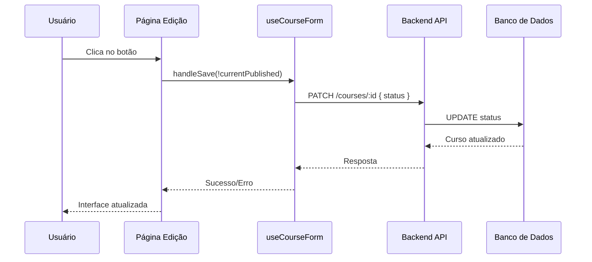

# Design: Atualização do Botão de Publicação na Página de Edição de Curso

## Visão Geral

Atualizar a interface do botão de publicação na página de edição de curso para refletir corretamente o status atual do curso no banco de dados. O botão deve alternar entre "Publicar Curso" e "Desativar Curso" baseado no status atual do curso (`PUBLISHED` ou `DRAFT`).

## Contexto do Problema

### Estado Atual
- O botão sempre exibe "Publicar Curso" independentemente do status do curso
- Não há diferenciação visual entre cursos publicados e rascunhos
- A funcionalidade atual apenas permite publicar, mas não despublicar

### Comportamento Esperado
- Se o curso estiver com status `PUBLISHED`: mostrar "Desativar Curso"
- Se o curso estiver com status `DRAFT`: mostrar "Publicar Curso"
- O botão deve alternar o status entre `PUBLISHED` e `DRAFT`

## Arquitetura da Solução

### Componentes Afetados

#### 1. Frontend - Página de Edição (`/app/admin/courses/[id]/page.tsx`)
- **Localização**: Linha 800-805 (botão de publicação)
- **Mudança**: Lógica condicional para texto e ação do botão

#### 2. Hook de Formulário (`/app/admin/courses/[id]/hooks/useCourseForm.ts`)
- **Localização**: Função `saveCourse` (linha 175-195)
- **Mudança**: Mapear corretamente `published` boolean para `status` enum

#### 3. Backend - API de Cursos
- **Endpoint**: `PATCH /courses/:id`
- **Campo**: `status` no banco de dados (já implementado)

### Fluxo de Dados



## Implementação Detalhada

### 1. Atualização da Interface do Botão

**Local**: `/app/admin/courses/[id]/page.tsx` (linhas 800-805)

**Estado Atual**:
```typescript
<button
  onClick={() => handleSave(true)}
  disabled={isSaving}
  className="px-6 py-2 bg-blue-600 text-white rounded-lg hover:bg-blue-700 flex items-center gap-2 disabled:opacity-50"
>
  <Eye className="w-4 h-4" />
  {isSaving ? 'Publicando...' : 'Publicar Curso'}
</button>
```

**Nova Implementação**:
```typescript
<button
  onClick={() => handleSave(!watch('published'))}
  disabled={isSaving}
  className={`px-6 py-2 rounded-lg flex items-center gap-2 disabled:opacity-50 ${
    watch('published')
      ? 'bg-yellow-600 text-white hover:bg-yellow-700'
      : 'bg-blue-600 text-white hover:bg-blue-700'
  }`}
>
  {watch('published') ? (
    <EyeOff className="w-4 h-4" />
  ) : (
    <Eye className="w-4 h-4" />
  )}
  {isSaving 
    ? (watch('published') ? 'Desativando...' : 'Publicando...')
    : (watch('published') ? 'Desativar Curso' : 'Publicar Curso')
  }
</button>
```

### 2. Mapeamento de Status no Hook

**Local**: `/app/admin/courses/[id]/hooks/useCourseForm.ts`

**Função `saveCourse` Atualizada**:
```typescript
const saveCourse = useCallback(async (data: CourseFormData) => {
  setIsSaving(true);
  try {
    // Mapear published boolean para status enum
    const payload = {
      ...data,
      status: data.published ? 'PUBLISHED' : 'DRAFT'
    };
    
    // Remover o campo published do payload
    delete payload.published;
    
    const url = courseId === 'new' ? `${API_URL}/courses` : `${API_URL}/courses/${courseId}`;
    const method = courseId === 'new' ? 'POST' : 'PUT';
    
    const response = await fetch(url, {
      method,
      headers: {
        'Content-Type': 'application/json',
        Authorization: `Bearer ${token}`,
      },
      body: JSON.stringify(payload)
    });

    if (!response.ok) throw new Error('Erro ao salvar curso');
    
    const savedCourse = await response.json();
    onSuccess?.(savedCourse);
  } catch (error) {
    onError?.(error as Error);
  } finally {
    setIsSaving(false);
  }
}, [courseId, onSuccess, onError]);
```

### 3. Atualização do Badge de Status

**Local**: `/app/admin/courses/[id]/page.tsx` (linhas 785-790)

**Melhoria do Badge**:
```typescript
<div className={`px-3 py-1 rounded-full text-sm font-medium ${
  !watch('published')
    ? 'bg-yellow-100 text-yellow-800 border border-yellow-200'
    : 'bg-green-100 text-green-800 border border-green-200'
}`}>
  {!watch('published') ? (
    <div className="flex items-center gap-1">
      <Clock className="w-3 h-3" />
      Rascunho
    </div>
  ) : (
    <div className="flex items-center gap-1">
      <CheckCircle className="w-3 h-3" />
      Publicado
    </div>
  )}
</div>
```

## Casos de Uso

### Caso 1: Curso em Rascunho
- **Estado**: `status: 'DRAFT'` no BD, `published: false` no form
- **Botão**: "Publicar Curso" (azul, ícone Eye)
- **Ação**: Clique altera para `status: 'PUBLISHED'`
- **Badge**: "Rascunho" (amarelo)

### Caso 2: Curso Publicado
- **Estado**: `status: 'PUBLISHED'` no BD, `published: true` no form
- **Botão**: "Desativar Curso" (amarelo, ícone EyeOff)
- **Ação**: Clique altera para `status: 'DRAFT'`
- **Badge**: "Publicado" (verde)

## Considerações Técnicas

### 1. Compatibilidade com Backend
- O backend já suporta o campo `status` com valores `DRAFT`, `PUBLISHED`, `ARCHIVED`
- Endpoint `PATCH /courses/:id` aceita `{ "status": "PUBLISHED" }`
- Não há necessidade de alterações no backend

### 2. Validação de Dados
- Manter validação existente no schema `courseFormSchema`
- Garantir que `published` boolean seja convertido corretamente para `status` enum

### 3. Estados de Loading
- Manter indicadores visuais durante salvamento
- Texto do botão deve refletir a ação em progresso

### 4. Tratamento de Erros
- Manter tratamento de erros existente no hook
- Exibir mensagens apropriadas para falhas de publicação/despublicação

## Impacto nos Usuários

### Administradores/Instrutores
- Interface mais intuitiva e clara sobre o status do curso
- Capacidade de despublicar cursos diretamente da interface
- Feedback visual melhorado sobre o estado atual

### Alunos (Impacto Indireto)
- Cursos despublicados não aparecerão nas listagens públicas
- Melhhor controle de qualidade dos cursos disponíveis

## Dependências

### Importações Adicionais
```typescript
// Adicionar ao imports existentes em page.tsx
import { EyeOff, Clock, CheckCircle } from 'lucide-react';
```

### Sem Dependências Externas
- Utiliza apenas funcionalidades já implementadas
- Não requer novas bibliotecas ou serviços

## Critérios de Aceitação

1. ✅ Botão exibe "Publicar Curso" quando curso está em rascunho
2. ✅ Botão exibe "Desativar Curso" quando curso está publicado  
3. ✅ Cores do botão mudam conforme o estado (azul/amarelo)
4. ✅ Ícones apropriados para cada estado (Eye/EyeOff)
5. ✅ Badge de status atualizado com ícones e cores
6. ✅ Textos de loading corretos ("Publicando..."/"Desativando...")
7. ✅ Funcionalidade de alternar entre estados funciona
8. ✅ Dados são salvos corretamente no banco de dados
9. ✅ Interface responde adequadamente a erros
10. ✅ Compatibilidade mantida com funcionalidades existentes